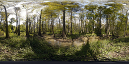
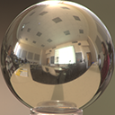
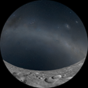
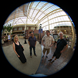
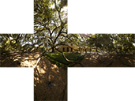
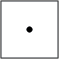
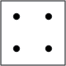
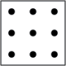

# Environment Mapping Tools

Copyright &copy; 2012&ndash;2013 &mdash; [Robert Kooima](http://kooima.net)

Copyright &copy; 2014&ndash;2015 &mdash; [Cedric Pinson](http://cedricpinson.com)


## All in One Command line
Current set of tools can be used from the python global launch script:
```sh
./process_environment.py --fixedge --write-by-channel my.hdr out
```
Will give out a out directolry filled with whatever possible env map data formatted for pbr


A set of tools to manipulate environment for Physical Based Rendering

## Spherical Remapping

This code supports reprojection and resampling between any two of the following spherical image projections. A high-resolution example image of each type is included.

<table>
    <tr><td></td><td>The <b>rect</b> type corresponds to the equirectangular projection, much like the common map of the world. It represents the full sphere, though with significant distortion near the poles. (<a href="etc/rect.tif">Example</a>.)</td></tr>

    <tr><td></td><td>The <b>ball</b> type corresponds to a photograph of a mirrored sphere, or "light probe". It represents the full sphere, but with significant distortion toward the back. (<a href="etc/ball.tif">Example</a>.)</td></tr>

    <tr><td></td><td>The <b>dome</b> type gives a "dome master". This is an image suitable for projection onto a fulldome planetarium. The view looks up and the radius varies linearly with latitude. It represents only half of the sphere. (<a href="etc/dome.tif">Example</a>.)</td></tr>

    <tr><td></td><td>The <b>hemi</b> type is mathematically identical to the dome type, though the view faces forward instead of up. This corresponds to a photograph taken with an 8mm "fisheye" lens. This too represents only half of the sphere. (<a href="etc/hemi.tif">Example</a>.)</td></tr>

    <tr><td></td><td>The <b>cube</b> type corresponds to an OpenGL cube map texture, and is the best choice for use in real-time 3D rendering. The TIFF contains each of the six cube faces in a separate page. The cube faithfully represents the full sphere with minimal distortion. (<a href="etc/cube.tif">Example</a>.)</td></tr>
</table>

The output is sampled using one of several sampling patterns, which give a quality-speed tradeoff.

<table>
    <tr><td></td><td><b>cent</b> &hellip; One sample at the centroid of the output pixel</td></tr>
    <tr><td></td><td><b>rgss</b> &hellip; Rotated-grid super sampling</td></tr>
    <tr><td></td><td><b>box2</b> &hellip; 2 &times; 2 super sampling</td></tr>
    <tr><td></td><td><b>box3</b> &hellip; 3 &times; 3 super sampling</td></tr>
    <tr><td></td><td><b>box4</b> &hellip; 4 &times; 4 super sampling</td></tr>
</table>

This tool remaps the input image `src.tif` to the output `dst.tif`. The sample depth and format of the input TIFF is preserved in the output.

`envremap [-i input] [-o output] [-p pattern] [-f filter] [-n n] src.tif dst.tif`

- `-i input`

    Input projection type. May be `ball`, `cube`, `dome`, `hemi`, or `rect`. The default is `rect`.

- `-o output`

    Output projection type. May be `ball`, `cube`, `dome`, `hemi`, or `rect`. The default is `rect`.

- `-p pattern`

    Output sampling pattern. May be `cent`, `rgss`, `box2`, `box3`, or `box4`. The default is `rgss`.

- `-f filter`

    Input filter type. Maybe `nearest` or `linear`. The default is `linear`.

- `-n n`

    Output size. Image will have size `n` &times; `n`, except `rect` which will have size 2`n` &times; `n`.

## Irradiance Generation

This tool generates an irradiance environment map from a given environment map using the same code in CubemapGen from amd and patched by [Sebastien Lagarde](https://seblagarde.wordpress.com/2012/06/10/amd-cubemapgen-for-physically-based-rendering/)

`envIrradiance [-n n] [-f fixup] in.tif dst.tif`

- `-n n`

    Output size. The output will be a 32-bit floating point TIFF with six pages, each `n` &times; `n` in size.

- `-f fixup method`


## BRDF LUT generation

This tool generates the brdf lut like in [UE4](http://blog.selfshadow.com/publications/s2013-shading-course/karis/s2013_pbs_epic_notes_v2.pdf)

`envBRDF [-s size] [-n samples] output.raw`

- `-s size`

    Output size. The output will be a rgba uint16 fixed integer.

- `-n samples`

    Number of samples used to generate the lut.


## Prefilter environment

This tool generates prefiltered environment like in [UE4](http://blog.selfshadow.com/publications/s2013-shading-course/karis/s2013_pbs_epic_notes_v2.pdf)

`envPrefilter [-s size] [-e stopSize] [-n nbsamples] [-f fixup flag ] in.tif out.tif`

- `-s size`

    Output size

- `-e stopSize`

    This limit the size of texture used to interpolate the roughness in different LOD. For example if you limit the size to 8, the roughness will be spread between size and 8.

- `-f toggle seamless`

    Generate cubemap with the stretch code from amd cubemap for seamless cubemap.

- `-n samples`

    Number of samples used to generate the lut.


## Background generation

This tool generates cubemap environment blurred to be used as background environment

`envBackground [-s size] [-n nbsamples] [-b blur angle ] [-f toggle fixup edge ] in.tif out.tif`

- `-s size`

    Output size

- `-b blurlevel`

    The blur level is the radius angle of the cone used to make the blur

- `-f toggle seamless`

    Generate cubemap with the stretch code from amd cubemap for seamless cubemap.

- `-n samples`

    Number of samples used to generate the lut.
